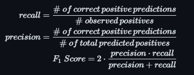

# Project 3 - Web APIs & NLP
insert presentation link here (this time to the pdf)
## Description
In the past year, the capability of modern AI models and the prevalence of AI-generated have come to the forefront of public discourse for more than just the more technical-minded. The endemic of AI-generated submissions in schools across all levels has created a need for a way to discern whether something was AI-generated or not. In this same vein, we took a look at 5413 posts on Reddit across 6 different subreddits and gathered the top-rated comment in each thread. The thread titles were then fed into the DaVinci Large Language Model (LLM) created by OpenAI in order to gather 5413 AI-generated responses to those thread titles. The primary goal was to build a model that could accurately discern whether a given response was real or AI-generated. 

The 6 subreddits used were:
- AskReddit
- AskScience
- AskHistorians
- NoStupidQuestions
- explainlikeimfive
- DoesAnybodyElse

These subreddits were chosen to represent a wide range of different types of question-answer format subreddits in order to create a model that was robust to different types of questions and answers. A secondary goal was to determine whether the subreddit had any effect on the ease of detecting whether a post was AI-generated or not. Our hypothesis was that subreddits such as AskScience and AskHistorians that have much more thorough and in-depth answers would cause an uneven performance for our model because subreddits such as DoesAnybodyElse and AskReddit have a higher tendency towards more flippant and shorter answers. 

## Data Gathering & Processing
We used the **Python Reddit API Wrapper (PRAW)** and attempted gather the top 1000 posts in the past year from each subreddit. Due to API access issues we were only able to get between 900 and 1000 posts from each subreddit. From that number, every thread where the comment was removed or deleted was excluded along with any posts that did not fit the question-answer format. Some of our subreddits do allow for posts to have body text that adds more context to the the question but due to OpenAI API limitations we did not include body text as a factor for generating our AI responses. 

**OpenAI** hosts a number of cutting edge AI models and are the organization behind the groundbreaking ChatGPT LLM that sparked the recent AI craze. We used their API to access the DaVinci LLM which works in similar ways to ChatGPT but is far less robust. The primary reason for using DaVinci over ChatGPT 3.5 was due to limitations on frequency of access for ChatGPT making the process untenable in our time frame given our large sample size. We were able to generate a response to every post gathered for a total of 5413 AI-generated 'reddit comments.' Due to monetary limitations, responses were limited in length which may have some effect on our ability to discern AI-generated comments.

Some effort was taken to clean the responses from both sources in order to maximize the differences the model was detecting in content and minimize structural differences between the real and AI-generated comments. In particular, Reddit requires two newline characters in order to format a new paragraph so we replaced all instances of multiple consecutive newline characters with a single newline character instead. Additionally, all instances of a comment referencing a user by their direct name (/u/\<name\>) was replaced with the pronoun 'they' to minimize syntaxical abberations caused by removing those references. Our results suggest that these changes had only a nominal effect on our modelling and are likely unnecessary in the case of further research in this vein.

## Metrics
We primarily measured model performance using accuracy:

    

 The other metrics used to compare our tuned final models were:

    

Recall (sensitivity) is a measure of how well our model classifies AI-generated posts as AI-generated. Precision (postitive predictive value) measures what proportion of our AI-generated predictions are correct. F1 Score is the harmonic mean of precision and recall and is used to measure how well balanced our model is between the two metrics. All three of these measures help us understand where our model goes wrong and are used to supplement our accuracy to provide context to that number.

## Models
We fit a number of models ranging from Naive Bayes to Ensemble methods and selected three high-performing models to explore further by tuning parameters in order to maximize predictive power. The three models selected were 
- **Extra Trees**: An ensemble classification method built on the basis of the Random Forest method.
- **Support Vector Machine**: A classification tool that fits a hyperplane that best splits the data into each class.
- **Adaptive Boosting**: An ensemble based model that trains a number of simple models in succession each weighted to adjust for the previous model's incorrect predictions.

We identified **Extra Trees**  as our best overall model by most metrics. An in-depth explanation of the Random Forest algorithm and Extra Trees as an extension of it can be found [here](https://quantdare.com/random-forest-many-are-better-than-one/) and [here](https://quantdare.com/what-is-the-difference-between-extra-trees-and-random-forest/). In brief, the Random Forest classification method works by fitting a number of simple decision trees on [bootstrapped](https://www.mastersindatascience.org/learning/machine-learning-algorithms/bootstrapping/) samples of data. The final prediction is the aggregate of each individual devision tree's prediction. Typically, the Random Forest method allows for highly accurate predictions while reducing variance when compared to a traditional decision tree. The Extra Trees model alters Random forest in two key ways: firstly there is no bootstrapping involved and secondly within each tree the additional randomness is introduced to the splitting process. By removing bootstrapping Extra Trees is a much faster model to train while reducing bias and adding randomness to the splitting process further reduces variance.

Here are sources for additional explanations for [Adaptive Boosting](https://www.analyticsvidhya.com/blog/2021/09/adaboost-algorithm-a-complete-guide-for-beginners/) and [Support Vector Machines](https://www.analyticsvidhya.com/blog/2021/10/support-vector-machinessvm-a-complete-guide-for-beginners/). Both models have their merits as explored in [the model evaluation notebook](./code/04-Model_Evaluation.ipynb).

## Conclusion & Future Work
Our final model was able to detect whether a comment was real or AI-generated with an accuracy of 93.02%. We also saw that our model had a tendency towards over-sensitivity and was more likely to incorrectly classify a real post as fake than it was to incorrectly classify a fake post as real. We can surmise that in our specific case, it is incredibly easy for a model to detect whether a comment is real or AI-generated. DaVinci is a fairly sophisticated model but it does not perform at the same level as the ChatGPT line of AI-models and clearly it cannot accurately mimic a response by an actual Reddit commentor.

We also found that our model performed very differently from subreddit to subreddit. In particular our model was quite adept at classifying posts on AskHistorians with a subreddit accuracy of 96.71%. Interestingly, our model did much worse at classifying posts on AskScience with an accuracy of only 91.77%. Further breakdowns of subreddit to subreddit performance can be found in [this notebook](./code/04-Model_Evaluation.ipynb).

For further research the easiest next step would be to run the same analysis using responses gathered using ChatGPT 3.5 or 4 depending on funding and time constraints. Both models are much more sophisticated than the DaVinci model which will affect how easily a model can identify if a post is written by an AI. Another simple next step would be to remove the token limit on the DaVinci model to see if allowing the AI to respond with no limitations has any effect on our ability to identify AI-generated comments.